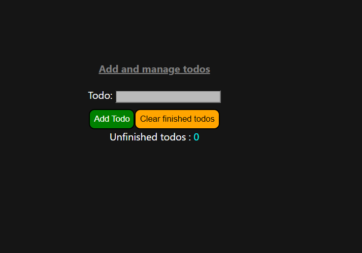
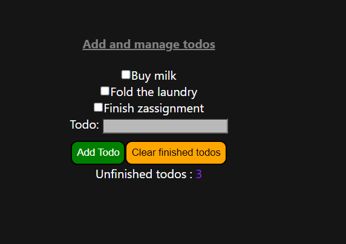
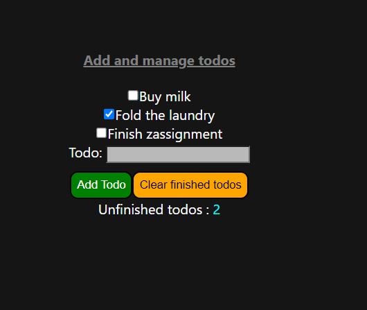
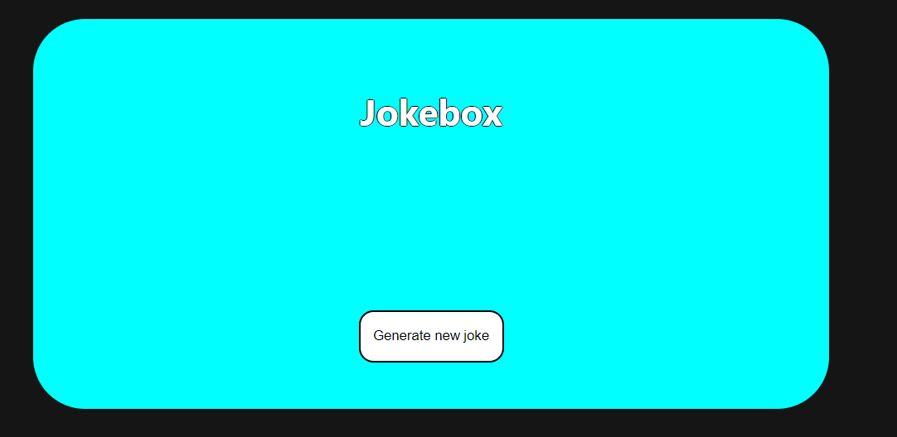
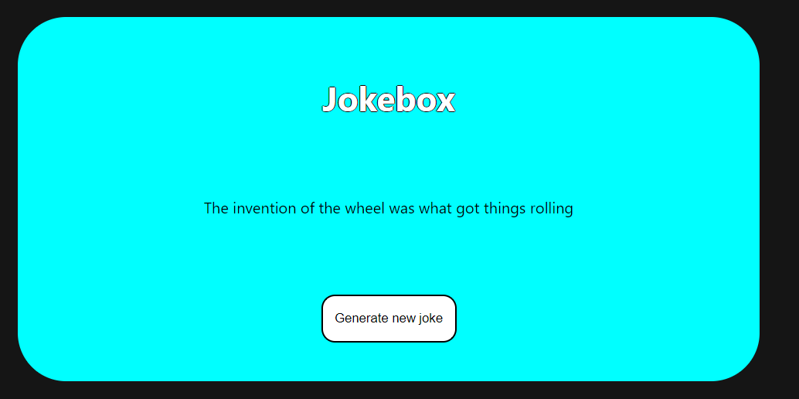

## React assignment ##

I have made an application with three *pages*. 
First one is the *landing/home page* where you can find some text and two buttons. 

Opon pressed, the buttons will send the user to one of the other *pages*. 

### Todos page ###

One of the other pages is the "Todos" page where the user can create a list of todos. The todos that the user adds shows up on the page with a checkbox next to it to mark the todo finshed. 

This is how it looks after a couple of todos have been added:

The number of unfished todos is also displayed.
If the number of finished todos is < 3, then the number is displayed in teal.
If the number of unfished todos is between three and five, it is displayed in purple. 
If number of unfinished todos is > 5 then it is displayed in red.  

### Dad jokes page ###

The other button on the homepage renders the *jokebox* where the user can generate random dad jokes. 
This page is easier and there is only one button on this page wich the user can press to generate a new joke. 

This is what it looks like when first going to the jokebox.

Once you press the *generate new joke* button, an API call is made and a random joke is fetched and displayed on the screen. The *generate new joke* button can be pressed as many times as the user would like.

